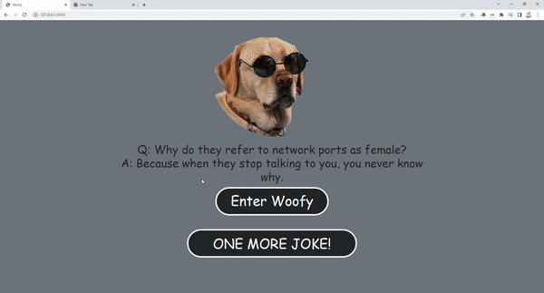
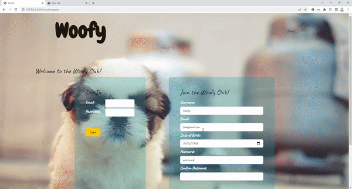
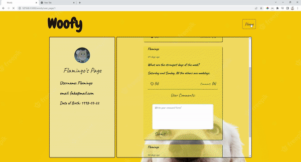
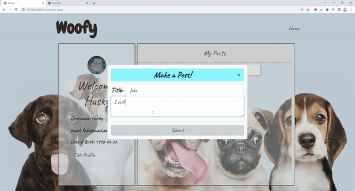

<!-- PROJECT LOGO -->
<br />
<div align="center">
  <a href="https://github.com/Flamingoo22/project_Woofy" name="readme-top">
    <h1>Woofy</h1>
  </a>
  
  <p align="center">
    An safe environment for dog lovers to share their stories with puppies.
    <br />
    <a href="https://github.com/Flamingoo22/project_Woofy"><strong>Explore the docs »</strong></a>
    <br />
    <br />
    <a href="https://github.com/Flamingoo22/project_Woofy">View Demo</a>
  </p>
</div>


<!-- TABLE OF CONTENTS -->
<details>
  <summary>Table of Contents</summary>
  <ol>
    <li>
      <a href="#about-the-project">About The Project</a>
      <ul>
        <li><a href="#built-with">Built With</a></li>
      </ul>
    </li>
    <li>
      <a href="#getting-started">Getting Started</a>
      <ul>
        <li><a href="#prerequisites">Prerequisites</a></li>
      </ul>
    </li>
    <li><a href="#contact">Contacts</a></li>
    <li><a href="#acknowledgments">Acknowledgments</a></li>
  </ol>
</details>


<!-- ABOUT THE PROJECT -->
## About The Project










<p>Woofy is my first full stack project built with python. The idea is to create a social media platform for people whose interested in dogs to either share their stories with puppies and for people whose looking to adapt dogs, they can also ask questions in the platform. All user information are secured with Bcrypt. And backend validation set up with python to avoid invalid registration credentials.</p>
<p>
 The fronted was built with HTML5, CSS, JS and bootstrap. And the server is using flask and mvp built in python. I used python to create global state variables in my project for data persistence and easy debugging purposes.
</p>
<p>
  And lastly the database is built with mySQL. I built the schema using mySQL workbench and established data relationships from there.
</p>
<p align="right">(<a href="#readme-top">back to top</a>)</p>


### Built With

This section lists any major frameworks/libraries used in this project.

* 
* 
* 
* 
* 
* 
* 

<p align="right">(<a href="#readme-top">back to top</a>)</p>


<!-- GETTING STARTED -->
## Getting Started

To get a local copy up and running follow these simple example steps.

### Prerequisites

Inside the project directory, open the virtual environment
* pip3
  ```sh
  pipenv shell
  ```
start the server
* python
  ```sh
  python server.py
  ```

<!-- CONTRIBUTING -->
## Contributing

Contributions are what make the open source community such an amazing place to learn, inspire, and create. Any contributions you make are **greatly appreciated**.

If you have a suggestion that would make this better, please fork the repo and create a pull request.

1. Fork the Project
2. Create your Feature Branch (`git checkout -b feature/AmazingFeature`)
3. Commit your Changes (`git commit -m 'Add some AmazingFeature'`)
4. Push to the Branch (`git push origin feature/AmazingFeature`)
5. Open a Pull Request

<p align="right">(<a href="#readme-top">back to top</a>)</p>


<!-- CONTACT -->
## Contacts

* Yifan Qiu - [@Linkedin](https://www.linkedin.com/in/yifan-qiu-9813bb232/) - yif.chu22@gmail.com

Project Link: [https://github.com/Flamingoo22/project_Woofy](https://github.com/Flamingoo22/project_Woofy)

<p align="right">(<a href="#readme-top">back to top</a>)</p>


<!-- ACKNOWLEDGMENTS -->
## Acknowledgments

This ReadME page is created using the template below:

* [README_Template](https://github.com/othneildrew/Best-README-Template/blob/master/README.md)

<p align="right">(<a href="#readme-top">back to top</a>)</p>
